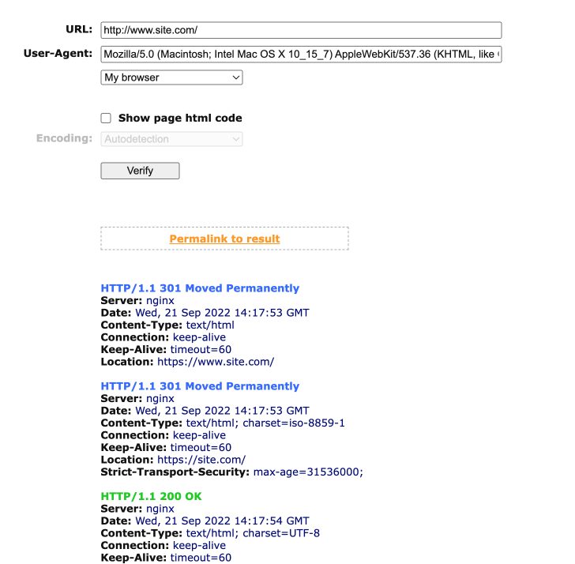

**Русский**

Инструкция:

**Вариант через Nginx:**

- Вы можете внести изменения в конфиг Nginx самостоятельно на свой страх и риск
1. Сделайте бэкап файла с конфигурацией
2. Вносите изменения

- Вы можете попросить техническую поддержку хостинга внести эти мзенения. Примерный текст для технической поддержки при создании тикета:

> Добрый день.
>
> Необходимо настроить 301 редирект с http://www.site.com на https://site.com и с https://www.site.com на https://site.com через конфигурационный файл nginx, чтобы не было двойных редиректов.
>
> > Не забудьте заменить site.com на название своего домена 
>
> (Приложите скриншот из [сервиса показывающего коды ответа сервера](https://bertal.ru/)).
>
> 
> 
> Спасибо.

- Если вдруг техническая поддержка не будет знать как это сделать, тогда отправьте им текст примерно следующего содержания:

> Добрый день.
>
> Можете помочь с настройкой 301 редиректа с http://www.site.com на https://site.com и с https://www.site.com на https://site.com через конфигурационный файл Nginx
>
> > Не забудьте заменить site.com на название своего домена
>
> Вот примерный код, который необходимо внести в конфигурационный файл Nginx
> 
> ```
> if ($host = "www.site-example.com") {
>   return 301 https://site-example.com$request_uri;
> }
> #return 301 https://$host:443$request_uri;
> return 301 https://$host$request_uri;
> ```
>
> Спасибо

**Вариант через файл .htaccess:**

Это решение больше справедливо для MODX, но может подойди и под другие CMS
1. Вносите изменения в .htaccess только тогда, когда вы убедились что у вас есть доступ по FTP / Cpanel / ISPManager или любой другой способ кроме как из под CMS
2. Сделайте бэкап файла .htaccess
3. Вносите изменения

```
# Rewrite www.example.com -> example.com -- used with SEO Strict URLs plugin
RewriteCond %{HTTP_HOST} .
RewriteCond %{HTTP_HOST} ^www.(.*)$ [NC]
RewriteRule ^(.*)$ https://%1/$1 [R=301,L]
#
# or for the opposite example.com -> www.example.com use the following
# DO NOT USE BOTH
#
#RewriteCond %{HTTP_HOST} !^$
#RewriteCond %{HTTP_HOST} !^www\. [NC]
#RewriteCond %{HTTP_HOST} (.+)$
#RewriteRule ^(.*)$ https://www.%1/$1 [R=301,L] .

# Force rewrite to https for every host
RewriteCond %{HTTPS} !=on [OR]
RewriteCond %{SERVER_PORT} !^443
RewriteRule ^ https://%{HTTP_HOST}%{REQUEST_URI} [L,R=301]
```

- Вы можете попросить техническую поддержку хостинга внести эти мзенения. Примерный текст для технической поддержки при создании тикета:

> Добрый день.
>
> Можете помочь с настройкой 301 редиректа с http://www.site.com на https://site.com и с https://www.site.com на https://site.com через файл .htaccess
>
> > Не забудьте заменить site.com на название своего домена
>
> Вот примерный код, который необходимо внести в файл .htaccess
> 
> ```
> # Rewrite www.example.com -> example.com -- used with SEO Strict URLs plugin
> RewriteCond %{HTTP_HOST} .
> RewriteCond %{HTTP_HOST} ^www.(.*)$ [NC]
> RewriteRule ^(.*)$ https://%1/$1 [R=301,L]
> #
> # or for the opposite example.com -> www.example.com use the following
> # DO NOT USE BOTH
> #
> #RewriteCond %{HTTP_HOST} !^$
> #RewriteCond %{HTTP_HOST} !^www\. [NC]
> #RewriteCond %{HTTP_HOST} (.+)$
> #RewriteRule ^(.*)$ https://www.%1/$1 [R=301,L] .
>
> # Force rewrite to https for every host
> RewriteCond %{HTTPS} !=on [OR]
> RewriteCond %{SERVER_PORT} !^443
> RewriteRule ^ https://%{HTTP_HOST}%{REQUEST_URI} [L,R=301]
> ```
>
> Спасибо

Вот и всё :)


**English (Google Translate)**

Инструкция:

Instructions:

**Option via nginx:**

- You can make changes to the nginx config yourself at your own peril and risk
1. Make backup file with configuration
2. Make changes

- You can ask for the technical support of the hosting to make these mzeniya. Approximate text for technical support when creating a tiket:

> Good afternoon.
>
> It is necessary to configure 301 redirect with http://www.site.com to https://site.com and with https://www.site.com to https://site.com through the nginx configuration file so that there is no Double redirects.
>
>> do not forget to replace site.com with the name of your domain
>
> (Attach a screenshot from [the service showing codes of the server’s response](https://bertal.ru/)).
>
> 
>
> Thank you.

- If suddenly technical support does not know how to do this, then send them the text of approximately the following content:

> Good afternoon.
>
> You can help with setting up 301 redirects with http://www.site.com at https://site.com and with https://www.site.com to https://site.com through the nginx configuration file
>
>> do not forget to replace site.com with the name of your domain
>
> Here is an approximate code that must be entered to the nginx configuration file
>
> ```
> if ($host = "www.site-example.com") {
>   return 301 https://site-example.com$request_uri;
> }
> #return 301 https://$host:443$request_uri;
> return 301 https://$host$request_uri;
> ```
>
> Спасибо

> Thank you

**Option via .htaccess:**

This solution is more fair for MODX, but it can come under other CMS
1. Make changes to the .htaccess only when you are convinced that you have access to ftp / cpanel / ispmanager or any other method except from CMS
2. Make Backup .htaccess file
3. Make changes

```
# Rewrite www.example.com -> example.com -- used with SEO Strict URLs plugin
RewriteCond %{HTTP_HOST} .
RewriteCond %{HTTP_HOST} ^www.(.*)$ [NC]
RewriteRule ^(.*)$ https://%1/$1 [R=301,L]
#
# or for the opposite example.com -> www.example.com use the following
# DO NOT USE BOTH
#
#RewriteCond %{HTTP_HOST} !^$
#RewriteCond %{HTTP_HOST} !^www\. [NC]
#RewriteCond %{HTTP_HOST} (.+)$
#RewriteRule ^(.*)$ https://www.%1/$1 [R=301,L] .

# Force rewrite to https for every host
RewriteCond %{HTTPS} !=on [OR]
RewriteCond %{SERVER_PORT} !^443
RewriteRule ^ https://%{HTTP_HOST}%{REQUEST_URI} [L,R=301]
```

- You can ask for the technical support of the hosting to make these mzeniya. Approximate text for technical support when creating a tiket:

> Good afternoon.
>
> You can help with setting up 301 redirects with http://www.site.com at https://site.com and with https://www.site.com at https://site.com through the .htaccess file.
>
>> do not forget to replace site.com with the name of your domain
>
> Here is an approximate code that must be entered to the .htaccess file
>
> ```
> # Rewrite www.example.com -> example.com -- used with SEO Strict URLs plugin
> RewriteCond %{HTTP_HOST} .
> RewriteCond %{HTTP_HOST} ^www.(.*)$ [NC]
> RewriteRule ^(.*)$ https://%1/$1 [R=301,L]
> #
> # or for the opposite example.com -> www.example.com use the following
> # DO NOT USE BOTH
> #
> #RewriteCond %{HTTP_HOST} !^$
> #RewriteCond %{HTTP_HOST} !^www\. [NC]
> #RewriteCond %{HTTP_HOST} (.+)$
> #RewriteRule ^(.*)$ https://www.%1/$1 [R=301,L] .
>
> # Force rewrite to https for every host
> RewriteCond %{HTTPS} !=on [OR]
> RewriteCond %{SERVER_PORT} !^443
> RewriteRule ^ https://%{HTTP_HOST}%{REQUEST_URI} [L,R=301]
> ```
>
> Thank you

That's all :)
