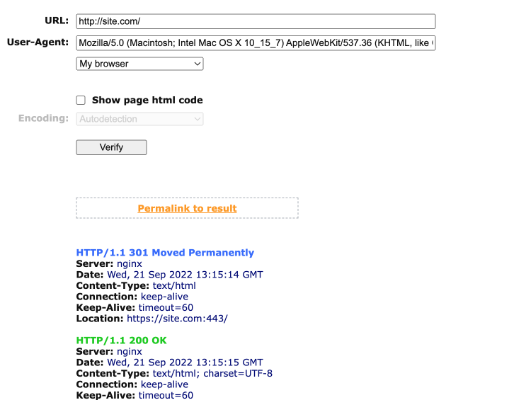

**Русский**

Инструкция:

- Вы можете внести изменения в конфиг Nginx самостоятельно на свой страх и риск
1. Сделайте бэкап файла с конфигурацией
2. Вносите изменения

- Вы можете попросить техническую поддержку хостинга внести эти мзенения. Примерный текст для технической поддержки при создании тикета:

> Добрый день.
> 
> Нужно убрать редирект через 443 порт.
> 
> (Приложите скриншот из [сервиса показывающего коды ответа сервера](https://bertal.ru/)).
> 
> 
> 
> Спасибо.

- На одном из проектов техническая поддержка сказала что тогда не будет работать защищенное соединение, тогда отправьте им текст примерно следующего содержания:

> Добрый день.
> 
> Также можно сделать?
> 
> Чтобы и защищенное соединение было и не было 443? Нужно внести изменения в настройки конфигурационного файла nginx моего сайта.
> 
> Вероятнее всего в конфигурационном файла nginx есть очень похожая запись. 
> 
> Могли бы закомментировать/изменить строку редиректа через 443 порт на редирект без 443 порта.
> ```
> #return 301 https://$host:443$request_uri;
> return 301 https://$host$request_uri;
> ```
> 
> Спасибо

Вот и всё :)


**English (Google Translate)**

Instruction:

- You can make changes to the Nginx config yourself at your own risk
1. Make a backup of the configuration file
2. Make changes

- You can ask the technical support of the hosting to make these opinions. Sample text for technical support when creating a ticket:

> Good afternoon.
>
> You need to remove the redirect through port 443.
>
> (Attach a screenshot from [service showing server response codes](https://bertal.ru/)).
>
> 
>
> Thank you.

- On one of the projects, technical support said that then a secure connection would not work, then send them a text with the following content:

> Good afternoon.
>
> also can be done?
>
> So that the secure connection was and was not 443? I need to make changes to the settings of the nginx configuration file of my site.
>
> Most likely there is a very similar entry in the nginx configuration file.
>
> Could comment out/change the redirect line through port 443 to a redirect without port 443.
> ```
> #return 301 https://$host:443$request_uri;
> return 301 https://$host$request_uri;
> ```
>
> Thank you

That's all :)
